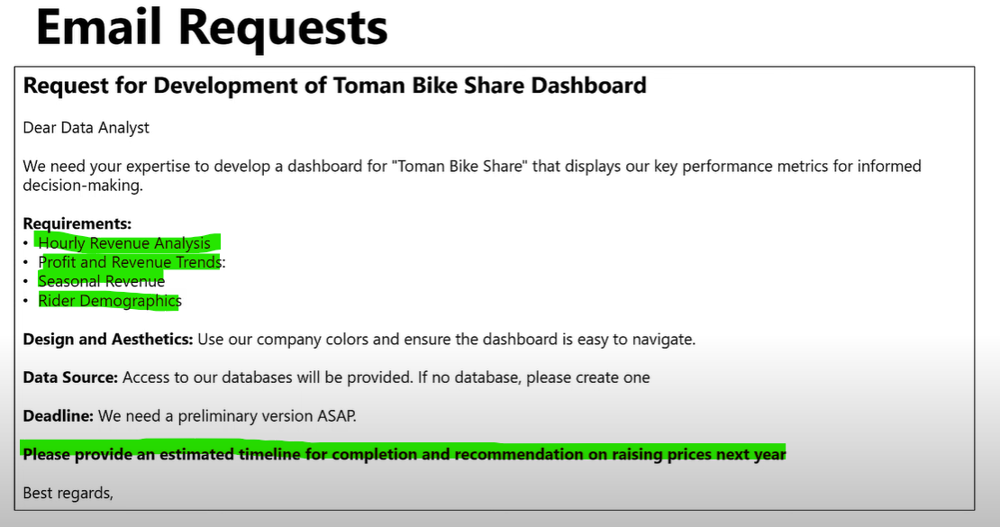
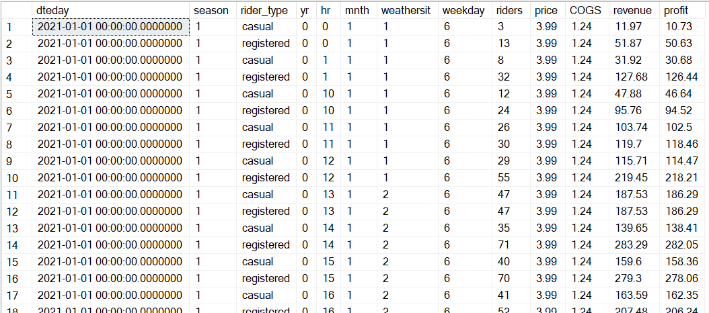
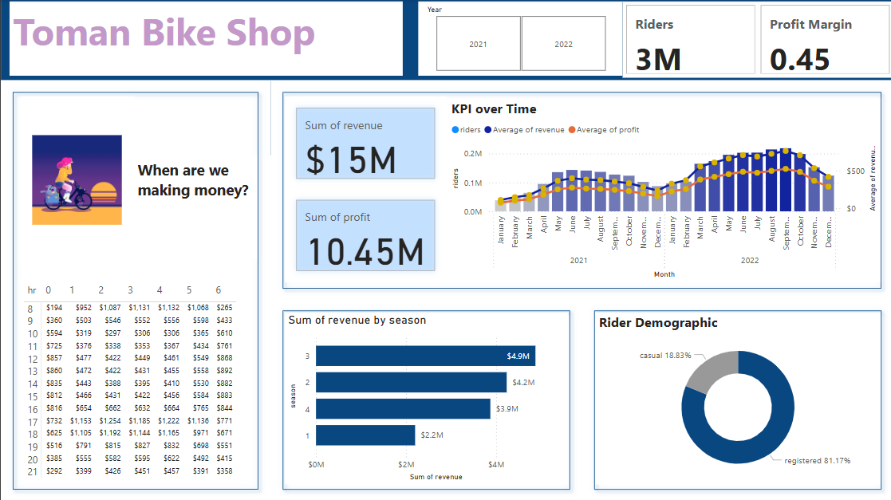

# Toman Bikes Analysis

### About company
Toman Bike Shop is a leading provider of cycling solutions with a robust presence both online and offline across the United States. Specializing in premium bicycles and accessories, our company is committed to enhancing customer experience.

Dataset link : https://www.kaggle.com/datasets/walmalki/toman-bike-share-dataset

### Project Overview
The objective of this project is to develop a comprehensive dashboard for Toan Bike, designed to display key performance metrics crucial for the company's strategic decision-making. This dashboard will provide insights into various aspects of the business, facilitating a data-driven approach to enhance operational efficiency and profitability.
 

## Requirement from stake holder


## Dataset
This dataset contains bike share data and the cost of rental bikes between 2021 and 2022 in the Capital bike share system with the corresponding weather and seasonal information.

dteday: The specific day of the data recording.

season: The season in which the data was recorded, with numerical representation.

yr: The year of the data, represented as a numerical value.

hr: The hour of the day when the data was recorded.

rider_type: The type of rider ie casual or registered riders.

riders: The number of riders during the specified hour.

price: The price charged per ride.

COGS (Cost of Goods Sold): The direct costs attributable to the rides.

revenue: The total revenue generated from the rides.

Profit: The net profit

## workflow
1. Create DB
2. Develop SQL queries
3. Connect power BI to the database
4. Build a dshboard in Power BI
5. Answer the analysis Question

### Data Processing
Data was loaded into the SQL platform.The two tables bike_share_yr_0 and bike_share_yr_1 was combined using union all into a CTE. The CTE was combined with cost_table to calculate the revenue and profit.The necessary fields were selected and new columns like revenue and profit was created

```
with cte as (
select * from bike_share_yr_1
union
select * from bike_share_yr_0)

select 
a.dteday,
a.season,
a.rider_type,
a.yr,
a.hr,
a.mnth,
a.weathersit,
a.weekday,
a.riders,
b.price,
b.COGS,
(a.riders*b.price) as revenue,
(a.riders*b.price -b.COGS) as profit
from cte a
left join cost_table b
on a.yr = b.yr;

```


### Analysis and Dashboarding
powerBI platform was used to further process and analyze and create dashboards.


##### Key observations:
* The riders demographic chart reveals there are more registered riders(almost 81%) and only 18% riders are casual riders. So there is strong preference for registration among majority of riders.
* Season 3 has generated highest revenue.
* Average revenue peaks during 5PM on weekdays, reaching highest on Friday. There is a steady decline in revenue from the morning,peaks at 8AM.
* On weekends revenue remains relatively low in the morning and steadily increases peaking around 3PM.

##### Recommendations
* Targeting marketing and operational strategies during weekday mornings and late afternoons should be implemented to maximize revenue. Emphasis should be layed on mid-week days for promotional activities as this will enable the company capitalize on the higher average revenues during these times.
* The upward trends in ridership and revenue, especially during peak summer months, highlight the need to focus resources and marketing efforts during these periods to maximize profitability, while maintaining cost efficiency to sustain high profit margins
* To maximize revenue, efforts should be concentrated on optimizing operations and marketing efforts during season 3. Initiatives such as running campaigns on safer routes and offering promotional sales for effective bike gear can be introduced to encourage more bike rides, thereby helping to increase revenue generation during season 1.
  
##### Recommendation on Price Increase
Based on the data for 2021 and 2022, Toman Bike Shop experienced significant growth in riders, revenue, and profit. The number of riders increased by 64.88%, resulting in a 106.20% rise in revenue and a 105.65% increase in profit. This indicates that the shop's strategies to attract more riders are highly effective. The revenue and profit were not affected by 25.06% increase in average price, suggesting that the customers are willing to pay more, and this could likely be due to perceived value or improved service delivery.

The price elasticity of demand is calculated at 2.59, indicating that demand is highly elastic. This suggests that customers are highly responsive to price changes. Given this high elasticity, Toman Bike Shop should be cautious with future price increases as significant price hikes could lead to decrease in demand.

* Price Strategy: Avoid substantial price increases to maintain demand. Consider small, incremental price adjustments (preferably at 10-15%) while focusing on enhancing value through improved services or bundled offers.

* Value Addition: Introduce added benefits or improved services alongside the price increase, such as better maintenance of bikes, enhanced safety features, or exclusive discounts for frequent riders. This will justify the price hike and retain customer loyalty.

* Targeted Communication: Clearly communicate the reasons for the price increase to riders, highlighting improvements in services and infrastructure. Transparency can help mitigate negative reactions.
